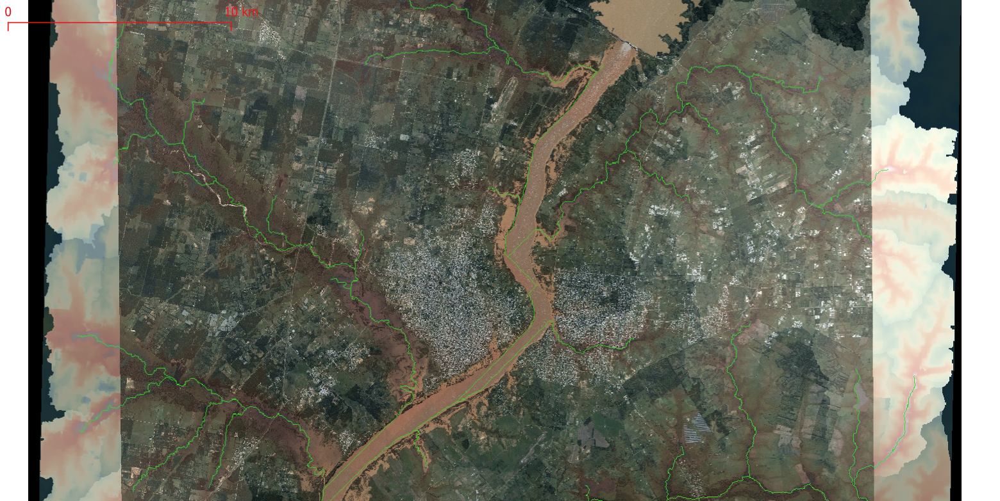
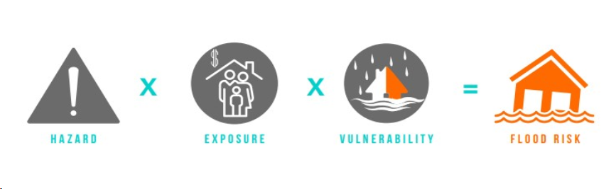

Primera Sesión
==============

Imagen ejemplo de superposición de vuelo CONAE sobre algoritmo HAND  en Concordia y Salto, Argentina y Uruguay,
14 de Mayo de 2024.

.. Máxima área inundada en la cuenca del Salado, periodo 2001-2016, procesado por `Tellman et al. (2021) 
.. <https://doi.org/10.1002/9781119427339.ch5>`_

Introducción
------------

* Motivación: principios del Riesgo

  * *H* : Hazard o probabilidad de la fuente u origen del riesgo. 
  * *L* : Exposure o exposición, tipicamente evaluable con un *GIS*.
  * *V* : Vulnerability o vulnerabilidad de la zona de exposición, es una función  *V(H)* sobre *L*.
  * *D* : Damage o daño; :math:`D = L * V(H)`.
  * *R* : Risk o riesgo; :math:`R = H * D = H * L * V(H)`.
  * *C* : Cost o coste de una acción mitigadora.
  * Evaluación de un evento de crisis en condiciones   :math:`R > C`, o equivalentemente 

.. math::
  H > \frac{C}{D} 

Actualmente *H* y *D* crecen como consecuencia del Cambio Climático.

* Objetivos generales del curso.

* Problemas de partida, dos escenarios bien diferentes: 

  * Llanura Pampeana: Azul, Buenos Aires. 
  * Quebrada Andina: Carossio, Lima.

Práctica de riesgo hídrico poblacional en La Pampa
--------------------------------------------------

* Basada en QGIS, con datos de radios censales, NBI, y capas JRC, siguiendo a Ramiro Páez.

Datos globales en abierto
-------------------------

* Herramientas para el mapping de inundaciones y software básico: 

  * *JRC* usando *QGIS*.
  * *JRC* y *GFD* usando *GEE*.
  * Eventos extremos, navegador *JBA* para Azul y Tandil, hipótesis de modelado a gran escala (Large Scale Modelling).
   
  * Redes hidro-meteorológicas en tiempo real del *IHLLA*: BDH e IHREDA. 
  * Incluyendo  pronósticos fluviales: *Google Flood Hub*.
  

* Modelos Digitales de Elevación:

  * *FABDEM* (MDT) sobre Copernicus-30, y modelos digitales del IGN.

* Ventajas e inconvenientes: por qué seguimos haciendo modelos propios.

