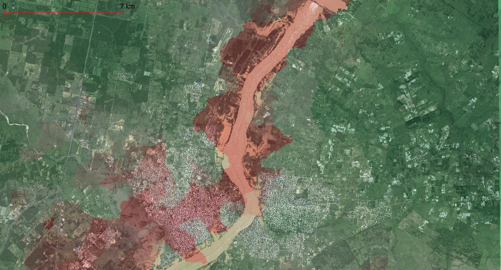

Primera Sesión
==============

Imagen ejemplo de superposición de algoritmo HAND sobre MDE con inundación real en Concordia y Salto, Argentina y Uruguay.

.. Máxima área inundada en la cuenca del Salado, periodo 2001-2016, procesado por `Tellman et al. (2021) 
.. <https://doi.org/10.1002/9781119427339.ch5>`_

Introducción
------------

.. image:: ./Pics/FR=Haz-Exp-Vul.png
  :width: 540
  :alt: FRdef
  :align: center 

* Objetivos generales del curso.

* Problemas de partida, dos escenarios bien diferentes: 

  * Llanura Pampeana: Azul, Buenos Aires. 
  * Quebrada Andina: Carossio, Lima.

Datos globales en abierto
-------------------------

* Herramientas para el mapping de inundaciones y software básico: 

  * *JRC* usando *QGIS*.
  * *JRC* y *GFD* usando *GEE*.
  * Eventos extremos, navegador *JBA* para Azul y Tandil, hipótesis de modelado a gran escala (Large Scale Modelling).
   
  * Redes hidro-meteorológicas en tiempo real del *IHLLA*: BDH e IHREDA. 
  * Incluyendo  pronósticos fluviales: *Google Flood Hub*.
  

* Modelos Digitales de Elevación:

  * *FABDEM* (MDT) sobre Copernicus-30, y modelos digitales del IGN.

* Ventajas e inconvenientes: por qué seguimos haciendo modelos propios.

