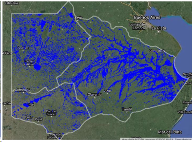

Primera Sesión
==============

Máxima área inundada en la cuenca del Salado, periodo 2001-2016, procesado por `Tellman et al. (2021) 
<https://doi.org/10.1002/9781119427339.ch5>`_

Introducción
------------

* Objetivos generales del curso.

* Problemas de partida, dos escenarios bien diferentes: 

  * Llanura Pampeana: Azul, Buenos Aires. 
  * Quebrada Andina: Carossio, Lima.

Datos globales en abierto
-------------------------

* Herramientas para el mapping de inundaciones y software básico: 

  * *JRC* usando *QGIS*.
  * *JRC* y *GFD* usando *GEE*.
  * Eventos extremos, navegador *JBA* para Azul y Tandil.
  * Google *Flood Hub*, en tiempo real y con pronóstico.
  * Índices de calidad: *Jaccard*, *RMSE*, *NSE*, etc.

* Modelos Digitales de Elevación:

  * *FABDEM* sobre Copernicus-30.

* Ventajas e inconvenientes: por qué seguimos haciendo modelos propios.

