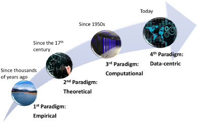
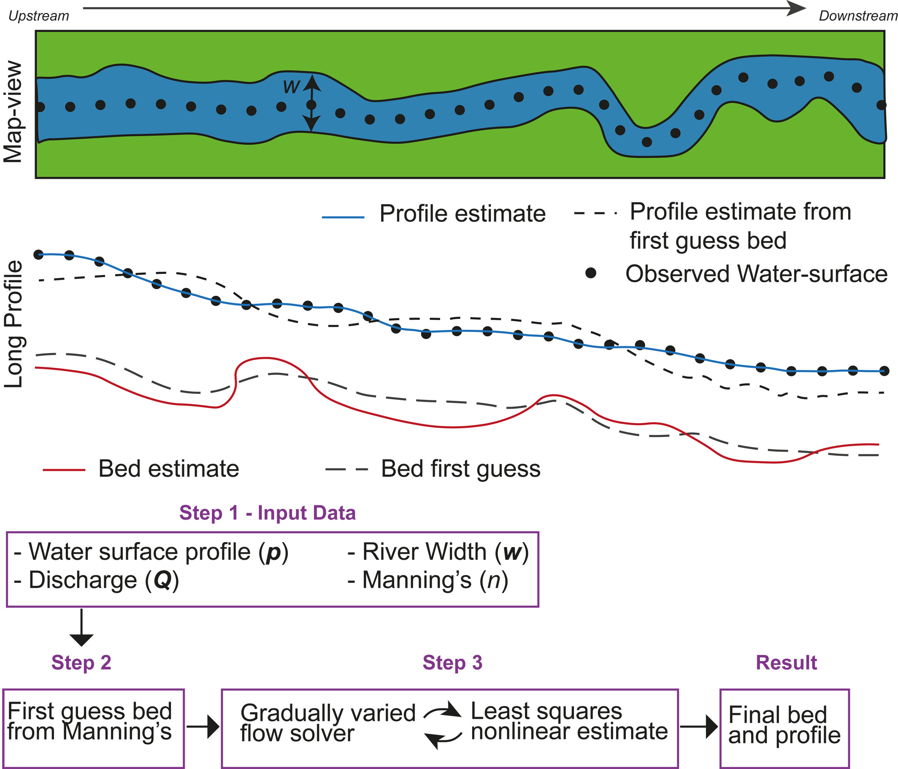

Segunda y tercera sesión: Modelos propios  estado del arte
==========================================================

.. image:: ./Pics/RRI_InOut.gif
  :width: 540
  :alt: RRI_InOut
  :align: center 

Principales actores de la modelización que se propone, imagen tomada del modelo japonés `Rainfall-RunOff-Inundation, RRI <https://www.pwri.go.jp/icharm/research/rri/index.html>`_. El estado del arte en una página, se puede leer en el trabajo de `Bates (2023): <https://www.nature.com/articles/s44221-023-00106-4.epdf?no_publisher_access=1&r3_referer=nature>`_ *Límites fundamentales en la modelización de inundaciones*. 
 
Paradigmas de la información: Aplicaciones-Teoría-Datos

Conceptos y ecuaciones básicas para modelizar procesos de lluvia-escorrentía e inundación
-----------------------------------------------------------------------------------------

* Ecuaciones de aguas poco profundas, enlace a curso de `Flood-Mapping <https://floodmapping.readthedocs.io>`_

* Estudio local con HEC-RAS para el municipio de Azul.

* Estudio pormenorizado en tiempo real, trabajando con: 

  #. DEM (MDE-Ar, FABDEM)
  #. JRC 
  #. HEC-RAS (propuesta sobre el río Dulce en Santiago del Estero)
  #. Algoritmo HAND sobre QGIS (propuesta sobre Concordia, Entre Ríos)
  #. Red de drenaje en Azul sobre Copernicus-30 obtenida con PCraster sobre QGIS

* Estudios a gran escala con Lisflood-FP, incluso continental, aproximación conceptual Sub-Grid, ver presentación del trabajo de Páez, Golin y Villanueva en `MECOM23@Concordia-Salto <https://amcaonline.org.ar/ojs/index.php/mc/article/view/6745>`_, y la estimación iterativa del lecho de `Neal et al. (2021)  <https://doi.org/10.1029/2020WR028301>`_.

Imagen conceptual de las iteraciones para definir el lecho del cauce.

