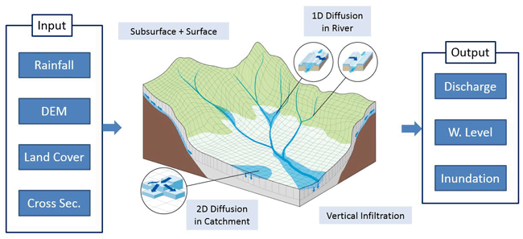

Segunda sesión: Modelos propios y estado del arte
=================================================

Principales actores de la modelización que se propone, imagen tomada del modelo japonés `Rainfall-RunOff-Inundation, RRI <https://www.pwri.go.jp/icharm/research/rri/index.html>`_. El estado del arte en una página, se puede leer en el trabajo de `Bates (2023): <https://www.nature.com/articles/s44221-023-00106-4.epdf?no_publisher_access=1&r3_referer=nature>`_ *Límites fundamentales en la modelización de inundaciones*. 
 

Generalidades del lenguaje *Python*: ejemplos básicos
-----------------------------------------------------

Ecuación Diferencial de balance vertical de una laguna
-------------------------------------------------------

Conceptos y ecuaciones básicas para modelizar procesos de lluvia-escorrentía e inundación
-----------------------------------------------------------------------------------------

* Ecuaciones de aguas poco profundas, enlace a curso de `Flood-Mapping <https://floodmapping.readthedocs.io>`_

* Estudios locales con HEC-RAS, Azul y Carossio, escala de pocos Km2.

* Estudios a gran escala con Lisflood-FP, incluso continental, aproximación conceptual Sub-Grid, ver presentación del trabajo de Páez, Golin y Villanueva en MECOM23@Concordia-Salto, y la estimación iterativa del lecho de `Neal et al. (2021)  <https://doi.org/10.1029/2020WR028301>`_.

. image:: ./Pics/IterativeBedEstimation.jpg
  :width: 540
  :alt: IterativeBedEstimation
  :align: center 

Imagen conceptual de las iteraciones para definir el lecho del cauce.

