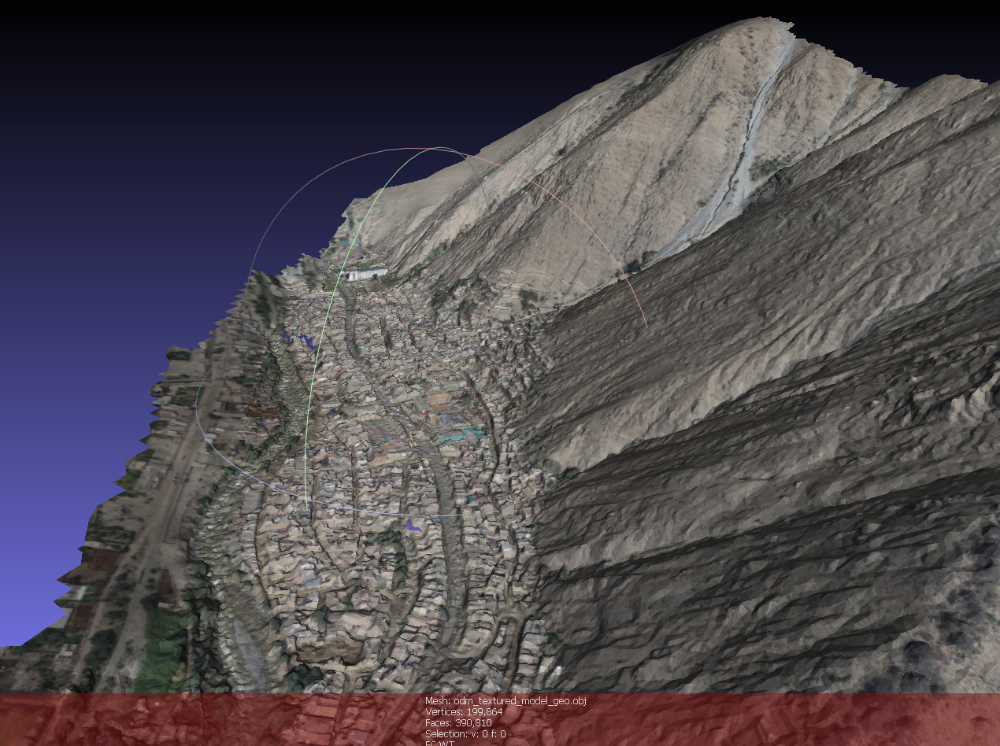

Tercera y Cuarta Sesión: revolución UAV (drone)
===============================================

Vista 3D de la quebrada 'Carossio en Lima, Perú <https://www.google.com/maps/place/Avenida+Lima+Norte/@-11.9257535,-76.6892762,1557m>'_

Usos básicos del drone
----------------------

Fotogrametría con Open-Drone-Map
--------------------------------
* Generación de Modelos Digitales de Elevaciones (MDE) para Carossio y Azul.

* Análisis de los MDEs previos con el modelo hidrodinámico HEC-RAS.

LSPIV con RIVeR
---------------

* Aforos por velocimetría de partículas a gran escala LSPIV, con videos drone.

* Casos particulares del arroyo Azul.
