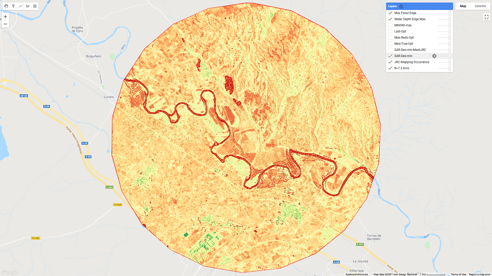

Sexta sesión: inicio de aplicaciones Google-Earth-Engine
========================================================

Explotación de señal SAR del Sentinel-1 en EbroLab. 

Inicio sesión y operaciones básicas
-----------------------------------
* Crear usuario, acceso a ficheros remotos

* Operaciones elementales con colecciones de imágenes

* Series Temporales

* Introducción a la familia de satélites Sentinel-ESA (Centinela, Agencia Europea Espacial): 1-SAR y 2-MSI.

Identificación de cuerpos de agua
----------------------------------

* Índice *NDWI*

* Distribución bimodal de *Otsu*

* Algoritmos de clasificación supervisados y no supervisados

* Cruzado con MDEs para medir volúmenes

Precipitación, humedad del suelo y otros índices
-------------------------------------------------

* Misiones satelitales *CHIRPS*, *GPM-IMERG*

* Soil Moisture con *SMAP*

* Índices *NDVI* y *SPI*

Scripts Compartidos
--------------------
`Google Earth Engine Scripts Ejemplo <https://code.earthengine.google.com/?accept_repo=users/ivillamadrid/UNCA>`_

