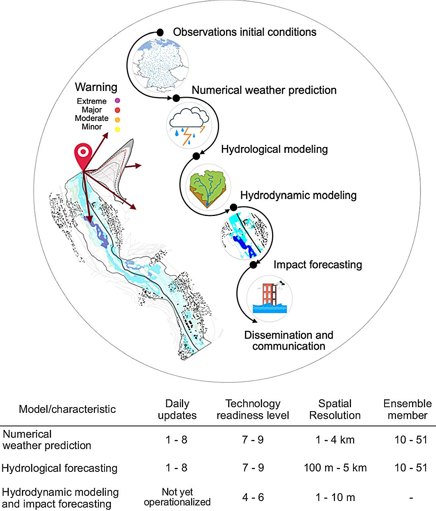

Sesiones especiales
===================

Se  intercalarán a lo largo del curso las sesiones siguientes por expertos a confirmar:

* Riesgo Hídrico Poblacional en Misiones, por Ramiro Páez.

* Interacción aguas subterráneas-superficiales, cuenca del Azul.

* Riesgo en entornos urbanos, armado de MDE a partir de vuelos drone y escenarios de lluvias, caso de Tandil, por Lorena La Macchia.

* Revisión de las recientes inundaciones en Porto Alegre y Concordia-Salto, con datos en abierto. 

Diagrama de flujo de datos y procesado en un Sistema de Alerta Temprana (SAT, o EWS Early-Warning-System), siguiendo a `Najafi et al. (2024) <https://doi.org/10.1038/s41467-024-48065-y>`_.

