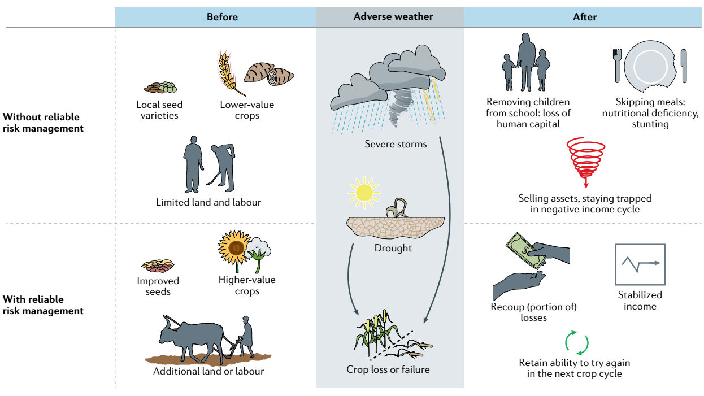

Sesiones especiales
===================

Se  intercalarán a lo largo del curso las sesiones siguientes por expertos a confirmar:

* Riesgo Hídrico Poblacional en Misiones, por Ramiro Páez.

* Interacción aguas subterráneas-superficiales, cuenca del Azul.

* Riesgo en entornos urbanos, armado de MDE a partir de vuelos drone y escenarios de lluvias, caso de Tandil, por Lorena La Macchia.

* Revisión de Módulos Agro-Hidrológicos para el sector agro.

Ejemplo de evaluación financiera del riesgo: daños acrecentados por cambio climático.
Cuadro figurativo de Risk Management para el sector agro, por `Benami et al. (2021) 
<https://doi.org/10.1038/s43017-020-00122-y>`_

